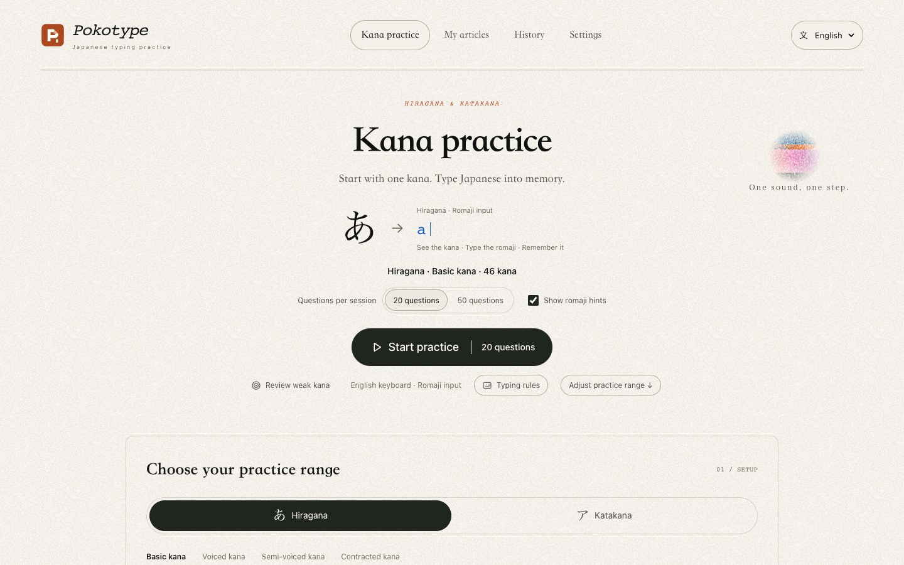
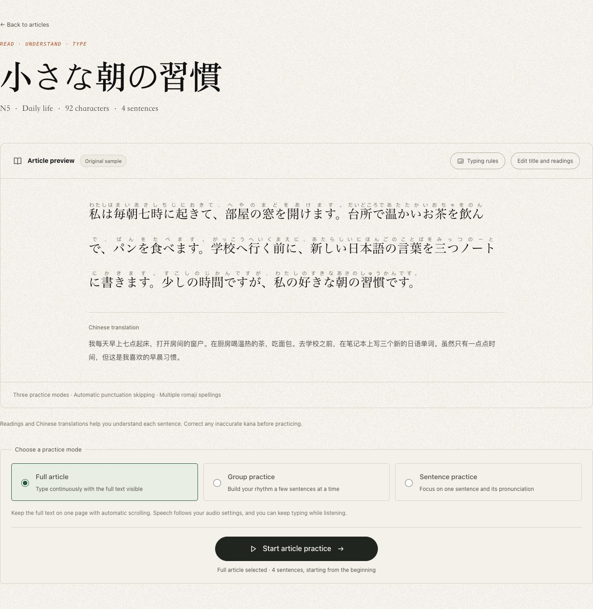
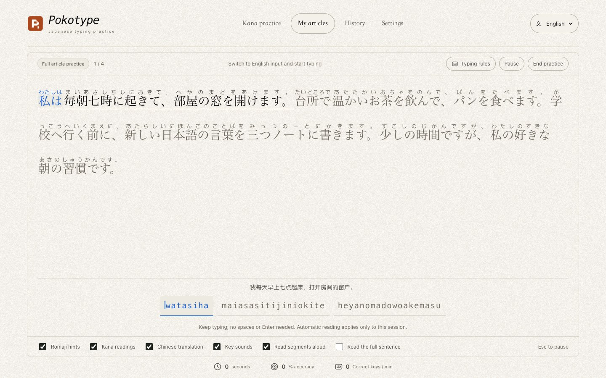

# Pokotype · Japanese Typing Practice

[日本語](README.ja.md) · [简体中文](README.md) · **English**

**From your first kana to full articles, type your way into Japanese.**

[Try it online](https://pokotype.vercel.app/en/) · [Application source](https://github.com/Altria1979/pokotype) · [Report an issue](https://github.com/Altria1979/pokotype/issues)

## 1. Background and Features

Recognizing kana, remembering their sounds, and typing them fluently are closely connected parts of learning Japanese. Pokotype brings them together in your browser: start by looking at kana and typing their romaji, then move on to full articles with readings, translations, and speech playback to build a regular typing habit.

The interface uses warm paper tones, a subtle grain texture, and simple typography to keep the focus on the text. No registration is required. Kana practice and the built-in sample articles work without an API key; AI article generation is optional.



| Feature | What you can do |
| --- | --- |
| Kana practice | Switch between hiragana and katakana; select rows of basic, voiced, semi-voiced, and contracted kana; practice 20 or 50 questions per session |
| Flexible romaji input | Use alternative spellings such as `shi/si`, `chi/ti`, and `tsu/tu`, with support for doubled consonants, small kana, and ambiguous 「ん」 sequences |
| Weak-kana review | Practice kana you find difficult, based on statistics from completed sessions |
| Article practice | Try 3 original samples in full-article, group (3, 5, or 10 sentences), or sentence mode, with kana hints and Chinese translations |
| AI article generation | Use your own DeepSeek or Alibaba Cloud Model Studio API key to generate articles by topic, N5–N1 level, and length |
| Article library and reading corrections | Save generated articles, preview the full text, and edit titles and kana readings; editing a sample creates a separate copy |
| Sound and speech | Enable key sounds, kana speech, and article playback by segment or sentence; adjust volume, speaking rate, and voice |
| Practice history | Review accuracy, correct keystrokes per minute, active practice time, and frequently missed kana |
| Three interface languages | 日本語, 简体中文, and English, sharing the same saved articles, results, and settings |

Typing practice is designed primarily for a computer with a physical keyboard. On a phone, you can browse articles, correct readings, and change settings. Switching the interface language does not translate the Japanese text or existing Chinese translations.

## 2. How to Use Pokotype

### Start a kana practice session

1. Open the [English version](https://pokotype.vercel.app/en/), [日本語 version](https://pokotype.vercel.app/ja/), or [简体中文 version](https://pokotype.vercel.app/zh-CN/). You can also switch languages in the page header.
2. Under “Choose your practice range,” select hiragana or katakana, then choose the categories and rows you want to practice.
3. Choose **20 questions** or **50 questions**. Keep “Show romaji hints” enabled when starting out.
4. Select “Start practice,” switch your input method to **English / half-width Latin characters**, and type directly on your keyboard.
5. Review your results after finishing. Once you have completed sessions, use “Review weak kana” to revisit difficult characters.

The home-page screenshot above shows the question count, start button, and practice-range controls.

### Move from reading to typing articles

1. Open “My articles” and choose an original sample, such as 「小さな朝の習慣」.
2. Read the Japanese text, kana readings, and Chinese translation. If needed, select “Edit title and readings,” make your changes, and save.
3. Choose a practice mode: **Full article** keeps the entire text visible and follows your typing position; **Group practice** presents 3, 5, or 10 sentences at a time; **Sentence practice** focuses on one sentence at a time. Full article is the initial default.
4. Select “Start article practice” and type continuously using the hints. During practice, you can toggle the display of romaji hints, kana readings, and Chinese translations, as well as sound effects.





### A few typing rules to remember

| Situation | How to type |
| --- | --- |
| Alternative spellings | 「し」 accepts `shi` or `si`; the hint shows one valid path |
| Particles | Follow the written kana: `は → ha`, `へ → he`, and `を → wo`; type 「私は」 as `watashiha` |
| Doubled consonants and contracted sounds | 「きって」 → `kitte`; 「しゃ」 → `sha` or `sya` |
| 「ん」 | A single `n` completes a standalone question or a sentence-final 「ん」; before a vowel or `y`, use `nn` or `n'` to distinguish it |
| Long vowels and punctuation | Type `-` for 「ー」; punctuation and whitespace are skipped automatically, and no spaces are needed between romaji groups |
| Mistakes | An incorrect key does not advance your position; simply type the correct character without using Backspace |
| Pausing and listening | Pressing `Esc`, switching tabs, or moving focus away from the window pauses practice; select the resume control to continue. Press `Enter` to skip full-sentence playback |

You can open “Typing rules” at any time. Opening it during practice pauses the session; after closing it, resume manually. Timing starts with the first correct keystroke and excludes pauses and full-sentence playback. Speed is measured in **correct keystrokes per minute**, not English words per minute (WPM).

### Generate articles you want to practice with AI

1. Open “Settings” and enter and save your own API key in the DeepSeek or Alibaba Cloud Model Studio card. Model Studio uses the compatible API endpoint for the Beijing region.
2. Select “Check connection.” After a successful check, view the model list and select a model that supports text chat, or enter a custom model ID. A successful connection check does not guarantee successful article generation or sufficient quota.
3. Return to “My articles” and select “Create an article.”
4. In the dialog, choose a provider, model, topic, Japanese level from **N5 to N1**, and a Short, Medium, or Long article length. Select “Create practice article.”
5. The generated article is automatically added to the current browser's library. Check its readings and translation before practicing.


AI requests use your own provider quota. No key is needed if you do not use AI. Keys are stored unencrypted in your local browser's localStorage, sent only to the selected provider's official API, and can be cleared in Settings. AI-generated readings, translations, and difficulty levels may be inaccurate; you can correct the readings before practicing.

### Saved data and sound settings

- Articles, results, and statistics are saved in the current browser. They do not automatically sync across browsers, devices, or site domains. Clearing website data also deletes this local content.
- An unfinished session exists only in page memory, so refreshing loses its progress. Saved settings and completed records remain. Unfinished sessions are not counted as completed records.
- Go to “Settings → Sound and speech” to adjust key sounds, automatic speech, volume, speaking rate, and voice. Japanese voices come from your browser or operating system; online voices may need an internet connection. You can still practice typing if no voice is available.
- Language switching is temporarily disabled during practice (including pauses and the results screen), while editing, while the generation dialog is open, or while data remains unsaved. Leave the practice screen, close the generation dialog, or save or cancel your edits before switching. If saving fails, select “Retry saving.”

### Run locally

You need Node.js **20.19 or later** and npm. Clone this repository, then run the following commands from the **project root**:

```sh
git clone https://github.com/Altria1979/pokotype.git
cd pokotype
npm ci
npm run dev
```

Open the address shown in your terminal, usually [http://localhost:3000](http://localhost:3000). Kana practice and sample articles do not require an `.env` file or an AI API key.

Build and preview the static site:

```sh
npm run build
npm run preview
```

The preview runs at [http://127.0.0.1:4173](http://127.0.0.1:4173), and the build output is in `out/`. This project uses static export and is served by a static server; `next start` is not needed. For production deployment, set the build variable `SITE_URL` to your full site domain so canonical links, hreflang links, and the sitemap use the correct address. Users configure their own AI API keys in the interface.

## 3. Technical Implementation and Open-Source Credits

### Technology stack

| Area | Implementation |
| --- | --- |
| Application and types | [Next.js 16](https://github.com/vercel/next.js) App Router + [React 19](https://github.com/facebook/react) + [TypeScript 5.9](https://github.com/microsoft/TypeScript) |
| Internationalization | [next-intl 4](https://github.com/amannn/next-intl), generating static pages for `/ja/`, `/zh-CN/`, and `/en/` |
| Interface | CSS Modules, global theme variables, local paper textures, and CSS decorations, without a third-party UI component library |
| Data | IndexedDB for articles, records, and statistics; localStorage for language, preferences, and provider API keys |
| AI | Direct browser requests to the official DeepSeek / Alibaba Cloud Model Studio Chat Completions APIs, with validation of structured article responses |
| Audio | Web Audio for synthesized key sounds and `speechSynthesis` for Japanese speech |
| Quality and deployment | [ESLint](https://github.com/eslint/eslint), [Vitest](https://github.com/vitest-dev/vitest), and [Playwright](https://github.com/microsoft/playwright); static export to `out/`, deployed on Vercel |

### Core implementation

- **Multiple valid input paths:** A dedicated romaji state machine retains valid spelling paths simultaneously, sharing nodes at kana boundaries to handle alternative spellings, doubled consonants, and 「ん」. It avoids enumerating every possible spelling of an entire sentence. Incorrect input leaves progress unchanged. See [`romaji.ts`](src/lib/romaji.ts).
- **Separate practice and timing logic:** Session logic manages input, pauses, speech playback, and completion, while the timer accumulates only active practice time. Article modes determine whether to display one sentence, a group, or the entire text. See [`practice-run.ts`](src/lib/practice-run.ts), [`session.ts`](src/lib/session.ts), and [`article-practice.ts`](src/lib/article-practice.ts).
- **Local browser persistence:** Stored data is version-validated. Completed records and kana statistics are written in a single IndexedDB transaction, with record IDs preventing duplicate saves. The application needs no backend of its own for user data. See [`storage.ts`](src/lib/storage.ts).
- **Optional AI generation:** Requests use the selected provider, model, topic, and difficulty. Japanese text, kana readings, and translations are validated before articles are saved to the library. Keys are stored separately for each provider, and requests do not pass through an application proxy server. See [`deepseek.ts`](src/lib/deepseek.ts) and [`articles.ts`](src/lib/articles.ts).
- **Static pages in three languages:** Translation dictionaries are separate from application data. Language routes control the interface language, while all three languages share local data. See [`src/i18n`](src/i18n).

For detailed development, deployment, routing, AI model, and audio behavior notes, see the [development and advanced usage guide (Chinese)](docs/development.md).

Run quality checks from the project root:

```sh
npm run lint
npm run typecheck
npm test
npm run build
npx playwright install chromium
npm run test:e2e
```

End-to-end tests run against the static output in `out/`. AI responses are mocked, so these tests do not incur real API charges.

### References and acknowledgments

| Project | How it informed Pokotype |
| --- | --- |
| [kanabr](https://github.com/L-M-Sherlock/kanabr) | A reference for the kana and romaji typing experience. Pokotype's practice logic and input engine were implemented independently, without copying its source code. |
| [Petrichor](https://github.com/Ciao1019/Petrichor) · [Visual reference](https://petrichor.wl.do/) | A visual reference for paper grain, Song-style serif headings, fine lines, pill-shaped buttons, and colorful shapes. Pokotype implements these ideas with its own CSS and local textures. |
| [UI Sift](https://github.com/Ciao1019/ui-sift) | A UI design and refactoring Skill used during development as a design-method reference. The application source retains its MIT license and pins it to [`e4e547d`](https://github.com/Ciao1019/ui-sift/tree/e4e547d9b3fbf22d138a8f7f04c83e9a816011d7). It is not an application runtime dependency. |

Thanks also to the maintainers of the open-source projects in the technology stack. The table distinguishes references for interaction, visual design, and development methods. Each project is used under its own license; this does not imply that Pokotype inherits the same license.

## 4. Contact the Author

If you encounter a problem, notice an incorrect reading or unexpected typing behavior, or have a feature suggestion, feel free to contact the author:

- **WeChat: `Altria1979`**
- GitHub: [Altria1979](https://github.com/Altria1979)
- Bug reports: [Open an issue](https://github.com/Altria1979/pokotype/issues)

When reporting a problem, include the page URL, browser version, steps to reproduce it, and screenshots where possible. Do not include API keys.
