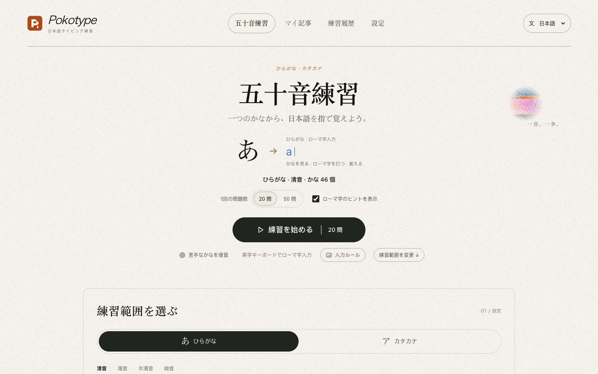
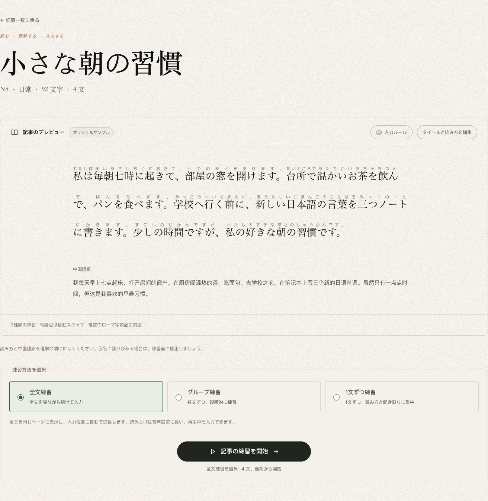
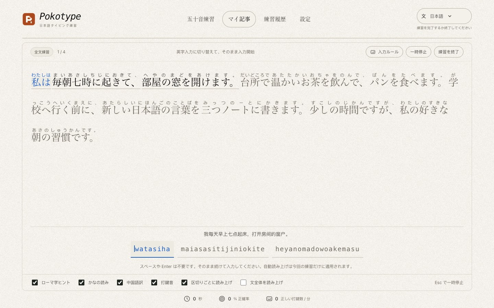
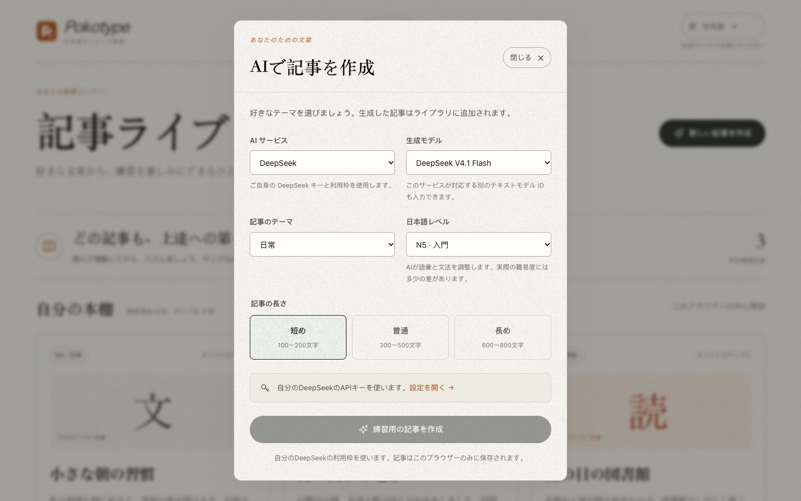

# Pokotype · 日本語タイピング練習

**日本語** · [简体中文](README.md) · [English](README.en.md)

**五十音から文章まで、一文字ずつ日本語を指先に。**

[オンラインで使う](https://pokotype.vercel.app/ja/) · [アプリのソースコード](https://github.com/Altria1979/pokotype) · [不具合を報告](https://github.com/Altria1979/pokotype/issues)

## 1. プロジェクトの背景と機能

仮名を見分けること、読み方を覚えること、スムーズに入力することは、日本語学習の中でつながっています。Pokotype は、その練習をブラウザーの一つの画面にまとめました。仮名を見てローマ字を打つところから始め、文章の入力へと進みながら、読み方・訳文・読み上げを手がかりに入力の習慣を身につけられます。

生成りの紙のような背景、粒子感のあるテクスチャ、すっきりしたレイアウトで、文字に集中しやすい画面にしています。ユーザー登録は不要です。五十音とサンプル記事は API キーなしで使え、AI による記事生成は必要に応じて利用できます。



| 機能 | できること |
| --- | --- |
| 五十音練習 | ひらがな／カタカナを切り替え、清音・濁音・半濁音・拗音を行ごとに選択。1 回 20 問または 50 問 |
| 柔軟なローマ字入力 | `shi/si`、`chi/ti`、`tsu/tu` など複数の表記に対応。促音、小書き仮名、「ん」の曖昧さも処理 |
| 苦手なかなの復習 | 完了した練習の仮名別統計をもとに、間違えやすい仮名を重点的に練習 |
| 文章練習 | 3 編のオリジナルサンプルを収録。全文・グループ（3／5／10 文）・1 文ずつの練習に対応し、仮名のヒントと中国語訳を表示 |
| AI による記事生成 | 自分の DeepSeek または Alibaba Cloud Model Studio（阿里百炼）のキーを使い、テーマ・N5〜N1 のレベル・長さを指定して記事を生成 |
| 記事ライブラリと読み方の修正 | 生成した記事の保存、全文のプレビュー、タイトルと仮名の読み方の編集。サンプルの変更は別のコピーとして保存 |
| サウンドと読み上げ | 打鍵音、仮名の読み上げ、記事の部分ごと／1 文ごとの読み上げ。音量、速度、音声を調整可能 |
| 練習履歴 | 正確率、1 分あたりの正しい打鍵数、有効な練習時間、間違えやすい仮名を確認 |
| 3 言語のインターフェース | 日本語・简体中文・English に対応。保存した記事、成績、設定は共通 |

タイピング練習は、パソコンと物理キーボードでの利用を想定しています。スマートフォンでは記事の閲覧、読み方の修正、設定の変更ができます。表示言語を切り替えても、日本語本文や保存済みの中国語訳は翻訳されません。

## 2. 使い方

### 五十音練習を始める

1. [日本語版](https://pokotype.vercel.app/ja/)、[简体中文版](https://pokotype.vercel.app/zh-CN/)、または [English](https://pokotype.vercel.app/en/) を開きます。画面上部でも言語を切り替えられます。
2. 「練習範囲を選ぶ」でひらがなまたはカタカナを選び、分類と練習する行を指定します。
3. **20 問**または **50 問**を選びます。初めての方は「ローマ字のヒントを表示」を有効にしておくと便利です。
4. 「練習を始める」をクリックし、入力モードを**英字／半角英数字**に切り替えて、キーボードで直接入力します。
5. 終了後に成績を確認します。完了した練習記録ができたら、「苦手なかなを復習」も使えます。

上のホーム画面のスクリーンショットで、問題数、開始ボタン、練習範囲の設定入口を確認できます。

### 読む練習から文章の入力へ

1. 「マイ記事」から記事ライブラリを開き、「小さな朝の習慣」などのオリジナルサンプルを選びます。
2. まず本文、仮名、中国語訳を読みます。修正が必要なら「タイトルと読み方を編集」をクリックして保存します。
3. 練習方法を選びます。**全文練習**は全文を表示したまま入力位置に追従し、**グループ練習**は 3・5・10 文ごと、**1 文ずつ練習**は 1 文に集中できます。初回は全文練習が選ばれています。
4. 「記事の練習を開始」をクリックし、ヒントに沿って続けて入力します。ローマ字のヒント、ふりがな、中国語訳の表示と、サウンドのオン／オフはいつでも切り替えられます。





### 覚えておきたい入力ルール

| 場面 | 入力方法 |
| --- | --- |
| 複数の表記 | 「し」は `shi` でも `si` でも入力できます。ヒントには有効な入力経路の一つが表示されます |
| 助詞 | 表記どおりに入力します：`は → ha`、`へ → he`、`を → wo`。「私は」は `watashiha` と入力できます |
| 促音と拗音 | 「きって」→ `kitte`、「しゃ」→ `sha` または `sya` |
| 「ん」 | 単独の問題や文末では `n` 一つで完了します。母音または `y` の前では `nn` か `n'` で区別します |
| 長音と句読点 | 「ー」は `-` で入力。句読点と空白は自動でスキップされ、ローマ字のまとまりの間にスペースを打つ必要はありません |
| 入力ミス | 間違えたキーでは進みません。そのまま正しい文字を入力でき、バックスペースは不要です |
| 一時停止と読み上げ | `Esc`、タブの切り替え、ウィンドウがフォーカスを失ったときに一時停止します。「練習を再開」で続けられます。1 文の読み上げ中は `Enter` でスキップできます |

画面の「入力ルール」はいつでも確認できます。練習中に開くと一時停止し、閉じた後は手動で再開します。計測は最初の正しい入力から始まり、一時停止中と 1 文の読み上げ中は有効時間に含まれません。速度は**1 分あたりの正しい打鍵数**で計算し、英単語数を表す WPM ではありません。

### AI で練習したい記事を作る

1. 「設定」を開き、DeepSeek または Alibaba Cloud Model Studio のカードに自分の API キーを入力して保存します。Model Studio は中国（北京）リージョンの互換 API を使用します。
2. 「接続を確認」をクリックします。成功するとモデル一覧を確認できるので、テキストチャットに対応したモデルを選びます。モデル ID を直接入力することもできます。接続確認の成功は、記事生成の成功や利用残高を保証するものではありません。
3. 記事ライブラリに戻り、「新しい記事を作成」をクリックします。
4. ウィンドウでサービス、モデル、テーマ、日本語レベル **N5〜N1**、長さ（短め／普通／長め）を選び、「練習用の記事を作成」をクリックします。
5. 生成した記事は現在のブラウザーの記事ライブラリに自動で追加されます。読み方と訳文を確認してから練習を始めましょう。



AI の呼び出しには、各サービスの自分の利用枠を使います。AI を使わなければキーの設定は不要です。キーは手元のブラウザーの localStorage に暗号化されずに保存され、選んだサービスの公式 API にのみ送信されます。設定画面から削除できます。AI が生成する読み方、訳文、難易度には誤りがある場合があるため、必要に応じて先に読み方を修正してください。

### データの保存とサウンド設定

- 記事、成績、統計は現在のブラウザーに保存されます。別のブラウザー、端末、サイトのドメインには自動で同期されません。サイトデータを消去すると、保存した内容も削除されます。
- 途中の練習はページのメモリー内にのみ保持され、再読み込みすると進捗が失われます。保存済みの設定と完了記録は残ります。未完了の練習は完了記録に含まれません。
- 「設定 → サウンドと読み上げ」で、打鍵音、自動読み上げ、音量、速度、音声を調整できます。日本語の音声はブラウザー／OS が提供します。オンライン音声にはネット接続が必要な場合があります。利用できる音声がなくてもタイピング練習は可能です。
- 練習中（一時停止中と結果画面を含む）、編集中、生成ウィンドウが開いている間、または未保存の内容がある間は、言語の切り替えが一時的に無効になります。練習画面を離れる、生成ウィンドウを閉じる、編集内容を保存またはキャンセルすると切り替えられます。保存に失敗した場合は「保存を再試行」などの再保存ボタンを使ってください。

### ローカルで実行する

Node.js **20.19 以降**と npm が必要です。このリポジトリをクローンし、**プロジェクトのルートディレクトリ**で以下のコマンドを実行してください。

```sh
git clone https://github.com/Altria1979/pokotype.git
cd pokotype
npm ci
npm run dev
```

ターミナルに表示されるアドレスを開きます。通常は [http://localhost:3000](http://localhost:3000) です。五十音とサンプル記事には、`.env` や AI のキーは必要ありません。

静的サイトをビルドしてプレビューする場合：

```sh
npm run build
npm run preview
```

プレビューのアドレスは [http://127.0.0.1:4173](http://127.0.0.1:4173)、出力先は `out/` です。このアプリは静的エクスポートを使用するため、静的ファイルを配信するサーバーで動作し、`next start` は不要です。本番環境へのデプロイ時は、ビルド用の環境変数 `SITE_URL` に自分のサイトの完全なドメイン URL を設定し、canonical、hreflang、sitemap を生成します。AI のキーは利用者が画面上で設定します。

## 3. 技術的な実装とオープンソースへの謝辞

### 技術スタック

| 項目 | 実装 |
| --- | --- |
| アプリと型 | [Next.js 16](https://github.com/vercel/next.js) App Router + [React 19](https://github.com/facebook/react) + [TypeScript 5.9](https://github.com/microsoft/TypeScript) |
| 国際化 | [next-intl 4](https://github.com/amannn/next-intl) で `/ja/`、`/zh-CN/`、`/en/` の 3 言語の静的ページをビルド |
| インターフェース | CSS Modules、グローバルなテーマ変数、ローカルの紙テクスチャ素材、CSS 装飾。外部の UI コンポーネントライブラリは不使用 |
| データ | 記事、記録、統計は IndexedDB、言語、各種設定、サービスごとのキーは localStorage に保存 |
| AI | ブラウザーから DeepSeek／Alibaba Cloud Model Studio の公式 Chat Completions API に直接リクエストし、返された構造化記事を検証 |
| 音声 | Web Audio で打鍵音を合成し、`speechSynthesis` で日本語を読み上げ |
| 品質管理とデプロイ | [ESLint](https://github.com/eslint/eslint)、[Vitest](https://github.com/vitest-dev/vitest)、[Playwright](https://github.com/microsoft/playwright)。`out/` に静的エクスポートし、Vercel にデプロイ |

### 実装のポイント

- **複数経路の入力判定**：独立したローマ字ステートマシンが有効な表記の経路を同時に保持し、仮名の境界でノードを共有します。表記の違い、促音、「ん」に対応し、文全体の全表記パターンを列挙する必要はありません。誤入力では進捗が変わりません。[`romaji.ts`](src/lib/romaji.ts) を参照してください。
- **練習処理と時間計測の分離**：セッションのロジックで入力、一時停止、読み上げ、完了を管理し、タイマーは有効な練習時間だけを加算します。文章の練習モードによって、1 文・グループ・全文の表示を切り替えます。[`practice-run.ts`](src/lib/practice-run.ts)、[`session.ts`](src/lib/session.ts)、[`article-practice.ts`](src/lib/article-practice.ts) を参照してください。
- **ブラウザー内での永続化**：データのバージョンを検証し、完了記録と仮名別統計を同一の IndexedDB トランザクションで保存します。記録 ID によって重複保存を防ぎます。アプリ専用のユーザーデータ用バックエンドは不要です。[`storage.ts`](src/lib/storage.ts) を参照してください。
- **任意で使える AI 拡張**：利用者が選んだサービス、モデル、テーマ、難易度からリクエストを作成し、日本語、仮名、訳文を検証して記事ライブラリに保存します。キーはサービスごとに保存され、アプリのプロキシサーバーを経由しません。[`deepseek.ts`](src/lib/deepseek.ts)、[`articles.ts`](src/lib/articles.ts) を参照してください。
- **3 言語の静的ページ**：翻訳辞書とアプリのデータを分離し、言語別ルートで表示言語を決めます。ローカルデータは 3 言語で共通です。[`src/i18n`](src/i18n) を参照してください。

開発・デプロイ・ルーティング・AI モデル・音声動作の詳細は、[開発と応用的な使い方のガイド（中国語）](docs/development.md)を参照してください。

プロジェクトのルートディレクトリで、品質チェックを実行できます。

```sh
npm run lint
npm run typecheck
npm test
npm run build
npx playwright install chromium
npm run test:e2e
```

E2E テストは `out/` の静的出力を対象に実行します。AI の応答にはモックデータを使うため、実際の API 呼び出し料金は発生しません。

### 参考にしたプロジェクトと謝辞

| プロジェクト | 参考にした点 |
| --- | --- |
| [kanabr](https://github.com/L-M-Sherlock/kanabr) | 仮名とローマ字の練習における入力体験を参考にしました。Pokotype の練習ロジックと入力エンジンは独自に実装しており、ソースコードはコピーしていません。 |
| [Petrichor](https://github.com/Ciao1019/Petrichor) · [ビジュアルの参考ページ](https://petrichor.wl.do/) | 紙の粒子感、明朝体の見出し、細い線、カプセル型ボタン、色のついた図形を参考にしました。本プロジェクトでは独自の CSS とローカルのテクスチャで実装しています。 |
| [UI Sift](https://github.com/Ciao1019/ui-sift) | 開発時に使った UI デザイン・リファクタリング用の Skill で、設計手法の参考にしました。アプリのソースコード内に MIT ライセンスを保持し、[`e4e547d`](https://github.com/Ciao1019/ui-sift/tree/e4e547d9b3fbf22d138a8f7f04c83e9a816011d7) にバージョンを固定しています。アプリの実行時依存ではありません。 |

技術スタックで使用している各オープンソースプロジェクトのメンテナーにも感謝します。上の表では、入力体験、ビジュアル、開発手法のそれぞれの参考元を示しています。各プロジェクトはそれぞれのライセンスに従って使用しており、Pokotype に同じライセンスが適用されることを意味するものではありません。

## 4. 作者への連絡

利用中の問題、読み方や入力ルールの不具合、機能の提案などがありましたら、お気軽にご連絡ください。

- **WeChat／微信：`Altria1979`**
- GitHub：[Altria1979](https://github.com/Altria1979)
- 不具合報告：[Issue を作成](https://github.com/Altria1979/pokotype/issues)

お問い合わせの際は、ページの URL、ブラウザーのバージョン、再現手順、スクリーンショットを添えていただけると助かります。API キーは含めないでください。
