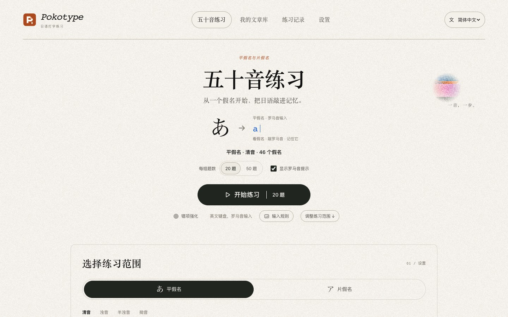
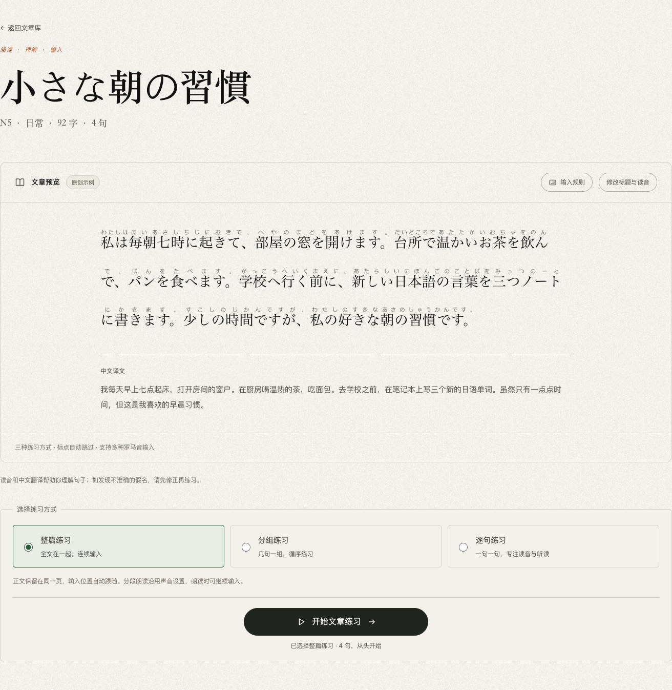
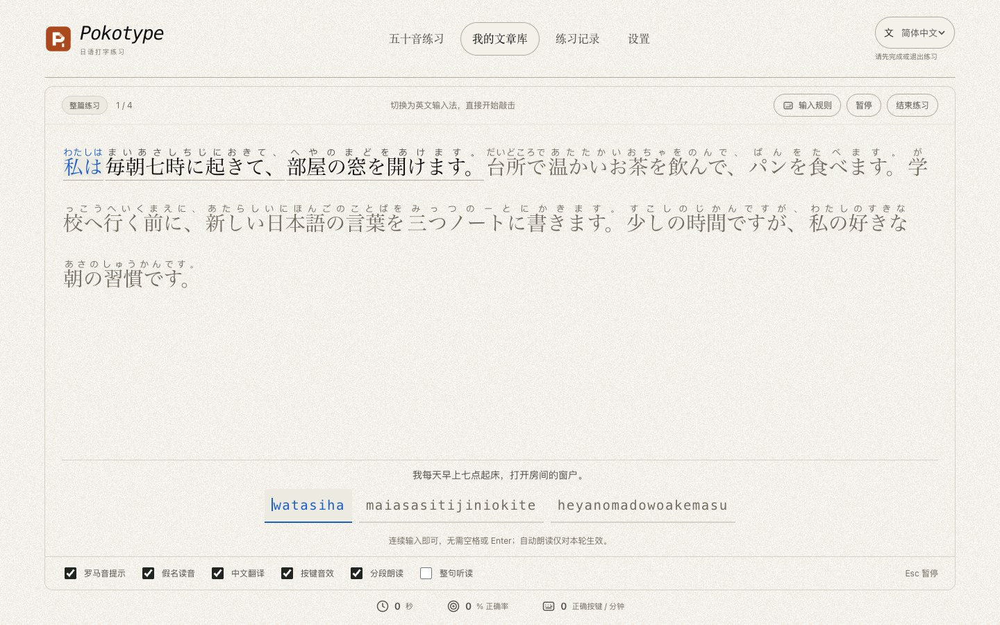

# Pokotype · 日语打字练习

[日本語](README.ja.md) · **简体中文** · [English](README.en.md)

**从五十音到文章，一点点敲进日语。**

[在线体验](https://pokotype.vercel.app/zh-CN/) · [桌面版 Releases](https://github.com/Altria1979/pokotype/releases) · [应用源码](https://github.com/Altria1979/pokotype) · [问题反馈](https://github.com/Altria1979/pokotype/issues)

## 1. 项目背景与功能

认识假名、记住读音和熟练输入，是学习日语时相互关联的练习。Pokotype 把它们放在同一个浏览器页面里：先看假名、敲出罗马音，再把练习延伸到完整文章，结合读音、译文和朗读建立输入习惯。

界面采用米白纸面、颗粒纹理与简洁的排版，尽量让注意力留在文字上。无需注册，五十音和内置示例文章无需 API 密钥即可使用；AI 生成文章是可选功能。



| 功能 | 可以做什么 |
| --- | --- |
| 五十音练习 | 平假名／片假名切换，按行选择清音、浊音、半浊音和拗音，每轮 20 或 50 题 |
| 灵活的罗马音输入 | 接受 `shi/si`、`chi/ti`、`tsu/tu` 等多种拼写，处理促音、小假名与「ん」的歧义 |
| 错项强化 | 根据已完成练习的假名统计，加强易错项练习 |
| 文章练习 | 3 篇原创示例；支持整篇、分组（3／5／10 句）、逐句练习，提供假名提示与中文译文 |
| AI 文章生成 | 使用自己的 DeepSeek 或阿里百炼密钥，按主题、N5–N1 等级和篇幅生成文章 |
| 文章库与读音修正 | 保存生成文章、预览全文、编辑标题和假名读音；修改示例会保存为独立副本 |
| 声音与朗读 | 按键音、假名朗读、文章分段／整句朗读，可调音量、语速和音色 |
| 练习记录 | 查看正确率、每分钟正确按键数、有效练习时间和易错假名 |
| 三语界面 | 日本語、简体中文、English；已保存的文章、成绩和设置共用 |

电脑、手机和 iPad 均可练习，支持实体键盘与系统英文 26 键键盘。电脑进入练习后直接敲键；触屏设备点题目或罗马音区域唤起键盘，并自行切换到英文键盘。网站不能代替你切换键盘语言。界面语言切换不会翻译日语原文或已有的中文释义。

## 2. 使用教程

### 开始一轮五十音练习

1. 打开[中文版](https://pokotype.vercel.app/zh-CN/)、[日本語版](https://pokotype.vercel.app/ja/)或 [English](https://pokotype.vercel.app/en/)，也可在页头切换语言。
2. 在「选择练习范围」中选择平假名或片假名，再选择分类和需要练习的行。
3. 选择 **20 题**或 **50 题**，初学时保留「显示罗马音提示」。
4. 点击「开始练习」，把输入法切到**英文／半角字母模式**。电脑可直接输入；手机和 iPad 点题目或罗马音区域唤起键盘，用系统英文 26 键键盘输入。
5. 完成后查看成绩；有了已完成记录，再使用「错项强化」复习。

上方首页截图展示了题数、开始按钮和练习范围入口。

### 从阅读过渡到文章输入

1. 进入「我的文章库」，打开任意原创示例，例如「小さな朝の習慣」。
2. 先阅读正文、假名和中文译文。如需调整，点击「修改标题与读音」并保存。
3. 选择练习方式：**整篇练习**保留全文并跟随输入位置；**分组练习**每组 3、5 或 10 句；**逐句练习**一次专注一句。首次默认整篇练习。
4. 点击「开始文章练习」，按提示连续输入；手机和 iPad 点题目或罗马音区域唤起键盘。可在「练习设置」中开关罗马音提示、假名读音和中文翻译的显示，以及声音效果。





### 记住这几条输入规则

| 情况 | 输入方法 |
| --- | --- |
| 多种拼写 | 「し」接受 `shi` 或 `si`，提示显示其中一条合法路径 |
| 助词 | 按书写形式输入：`は → ha`、`へ → he`、`を → wo`；「私は」可输入 `watashiha` |
| 促音与拗音 | 「きって」→ `kitte`，「しゃ」→ `sha` 或 `sya` |
| 「ん」 | 独立题或句末输入一个 `n` 即完成；元音或 `y` 前使用 `nn` 或 `n'` 消歧 |
| 长音和标点 | 「ー」输入 `-`；标点、空白自动跳过，罗马音分组间无需敲空格 |
| 输错 | 错误按键不会推进，继续输入正确字符即可，无需退格 |
| 暂停和听读 | 切换标签页或窗口失焦会暂停计时，返回后直接输入即可继续打字，恢复输入的第一键也会计入；`Esc` 或暂停按钮主动暂停后需点击继续。整句听读暂停后点击继续可重新朗读，也可按 `Enter` 跳过 |

页面上的「输入规则」可随时查阅；练习中打开会暂停，关闭后需手动继续。计时从首次正确输入开始，暂停和整句听读时间不计入有效时间。速度以**每分钟正确按键数**计算，不是英文单词数 WPM。

### 用 AI 生成想练习的文章

1. 打开「设置」，在 DeepSeek 或阿里百炼卡片中填写并保存自己的 API 密钥。百炼使用北京地域的兼容接口。
2. 点击「检查连接」，成功后可查看模型列表，再选择支持文本对话的模型，也可输入自定义模型 ID。连接检查不等于文章生成成功或额度充足。
3. 回到「我的文章库」，点击「生成新文章」。
4. 在弹窗中选择服务、模型、主题、日语等级 **N5–N1** 和短／中／长篇幅，点击「生成练习文章」。
5. 生成后文章自动加入当前浏览器的文章库；先检查读音与译文，再开始练习。


AI 调用消耗你自己的服务额度；不使用 AI 时无需配置密钥。密钥保存在本机浏览器的 localStorage 中，未加密，仅发送到所选服务的官方接口，可在设置中清除。AI 生成的读音、翻译和难度可能有误，可以先修正读音。

### 数据保存与声音设置

- 文章、成绩和统计保存在当前浏览器。更换浏览器、设备或站点域名不会自动同步，清除网站数据也会删除本地内容。
- 未完成的练习仅保存在页面内存中，刷新会失去进度；已保存的设置和完成记录仍保留。未完成练习不会计为完成记录。
- 在「设置 → 声音与朗读」调整按键音、自动朗读、音量、语速和音色。日语语音由浏览器／系统提供，在线音色可能需要联网；没有可用音色时仍能打字练习。
- 练习期间（含暂停和结果页）、编辑、生成窗口打开或存在未保存内容时，语言切换会暂时禁用。退出练习页面、关闭生成窗口，或保存／退出编辑后再切换；保存失败时请使用「重试保存」。

### macOS / Windows 桌面版

桌面版使用 Tauri 2 封装同一套静态页面，安装包通过 [GitHub Releases](https://github.com/Altria1979/pokotype/releases) 分发：Mac Apple Silicon（arm64）与 Intel 各提供 `.dmg`，Windows x64 提供 `.exe`。请以 Releases 中实际发布的附件为准；若尚无桌面版附件，可继续使用网页版。

首版为公开测试版，Mac 暂无 Developer ID 签名与公证，Windows 暂无发行签名，系统可能提示或拦截安装。基础假名练习、内置和已保存文章可以离线使用；AI 生成需要联网，朗读是否离线可用取决于系统音色。桌面版的数据与浏览器独立，不自动迁移或同步。

更新时退出应用，再下载同平台的新版安装包覆盖安装；没有应用内自动更新。保留应用数据时，正常退出重开和覆盖升级应保留已保存内容；卸载、清理应用数据后重装可能丢失文章、记录和密钥。正式签名与自动更新留待后续版本。

开发环境除 Node.js / npm 外，还需 Rust 与平台编译工具，按 [Tauri 官方环境要求](https://v2.tauri.app/start/prerequisites/)准备。运行 `npm run desktop:dev` 开发，`npm run desktop:build` 打包，`npm run desktop:icon` 生成图标。`desktop-v*` 标签触发三平台打包；检查、全部安装包和原生验收记录齐备后才创建 Pre-release。安装、构建、验收与发布步骤见[桌面版指南](docs/desktop.md)。

### 在本地运行

需要 Node.js **20.19 或更高版本**及 npm。克隆本仓库后，在**项目根目录**执行以下命令：

```sh
git clone https://github.com/Altria1979/pokotype.git
cd pokotype
npm ci
npm run dev
```

打开终端显示的地址，通常为 [http://localhost:3000](http://localhost:3000)。五十音和示例文章不需要 `.env` 或 AI 密钥。

构建并预览静态站点：

```sh
npm run build
npm run preview
```

预览地址为 [http://127.0.0.1:4173](http://127.0.0.1:4173)，产物位于 `out/`。这是静态导出项目，使用静态服务器提供服务，无需 `next start`。默认以正式站点 `https://pokotype.vercel.app` 生成 canonical、hreflang、robots 和 sitemap。部署到自己的域名时，在构建前设置 `SITE_URL`；AI 密钥由用户在页面中配置。SEO 验收与收录提交说明见 [SEO 指南](docs/seo.md)。

## 3. 技术实现与开源致谢

### 技术栈

| 部分 | 实现 |
| --- | --- |
| 应用与类型 | [Next.js 16](https://github.com/vercel/next.js) App Router + [React 19](https://github.com/facebook/react) + [TypeScript 5.9](https://github.com/microsoft/TypeScript) |
| 国际化 | [next-intl 4](https://github.com/amannn/next-intl)，构建 `/ja/`、`/zh-CN/`、`/en/` 三套静态页面 |
| 界面 | CSS Modules、全局主题变量、本地纸纹素材与 CSS 装饰，无第三方 UI 组件库 |
| 数据 | IndexedDB 保存文章、记录和统计；localStorage 保存语言、偏好和各服务密钥 |
| AI | 浏览器直接请求 DeepSeek／阿里百炼官方 Chat Completions 接口，校验返回的结构化文章 |
| 音频 | Web Audio 合成按键音，`speechSynthesis` 提供日语朗读 |
| 质量与部署 | [ESLint](https://github.com/eslint/eslint)、[Vitest](https://github.com/vitest-dev/vitest)、[Playwright](https://github.com/microsoft/playwright)；静态导出到 `out/`，部署于 Vercel |

### 核心实现

- **多路径输入判定**：独立的罗马音状态机同时保留合法拼写路径，以假名边界共享节点，处理不同拼法、促音与「ん」；不用枚举整句话的所有拼写组合。错误输入不改变进度。见 [`romaji.ts`](src/lib/romaji.ts)。
- **练习与计时分离**：会话逻辑管理输入、暂停、听读和完成，计时器只累加有效练习时间；文章模式决定显示一句、一组还是全文。见 [`practice-run.ts`](src/lib/practice-run.ts)、[`session.ts`](src/lib/session.ts) 和 [`article-practice.ts`](src/lib/article-practice.ts)。
- **浏览器本地持久化**：数据带版本校验，完成记录和假名统计在同一 IndexedDB 事务中写入，按记录 ID 避免重复保存。应用无需自己的用户数据后端。见 [`storage.ts`](src/lib/storage.ts)。
- **可选 AI 扩展**：以用户选择的服务、模型、主题和难度构造请求，校验日文、假名和译文后写入文章库；密钥按服务分别保存，不通过应用代理服务器。见 [`deepseek.ts`](src/lib/deepseek.ts) 和 [`articles.ts`](src/lib/articles.ts)。
- **三语静态页面**：翻译字典与业务数据分离，语言路由决定界面语言，三语共用本地数据。见 [`src/i18n`](src/i18n)。

更多开发、部署、路由、AI 模型和音频细节见[开发与进阶使用指南](docs/development.md)。

在项目根目录执行质量检查：

```sh
npm run lint
npm run typecheck
npm test
npm run build
npx playwright install chromium
npm run test:e2e
```

端到端测试面向 `out/` 静态产物；AI 响应使用模拟数据，不会产生真实 API 调用费用。

### 参考与致谢

| 项目 | 参考方式 |
| --- | --- |
| [kanabr](https://github.com/L-M-Sherlock/kanabr) | 假名与罗马音练习的输入体验参考。Pokotype 的练习逻辑和输入引擎独立实现，未复制其源码。 |
| [Petrichor](https://github.com/Ciao1019/Petrichor) · [视觉参考页](https://petrichor.wl.do/) | 参考纸面颗粒、宋体标题、细线、胶囊按钮和彩色图形的视觉语言；本项目以自己的 CSS 和本地纹理实现。 |
| [UI Sift](https://github.com/Ciao1019/ui-sift) | 开发时采用的界面设计与重构 Skill，作为设计方法参考。应用源码保留其 MIT 许可，固定版本为 [`e4e547d`](https://github.com/Ciao1019/ui-sift/tree/e4e547d9b3fbf22d138a8f7f04c83e9a816011d7)，不属于应用运行时依赖。 |

也感谢技术栈中各开源项目的维护者。上表区分了体验、视觉与开发方法参考；各项目按其自身许可证使用，不代表 Pokotype 继承相同许可证。

## 4. 联系作者

使用中遇到问题、发现读音或输入规则异常，或希望交流功能建议，欢迎联系作者：

- **WeChat／微信：`Altria1979`**
- GitHub：[Altria1979](https://github.com/Altria1979)
- 问题反馈：[提交 Issue](https://github.com/Altria1979/pokotype/issues)

反馈时可附上页面地址、浏览器版本、复现步骤和截图，请勿附带 API 密钥。

## 5. 许可证

Copyright 2026 Altria1979.

Pokotype 采用 [Apache License 2.0](LICENSE) 许可证。第三方依赖与随附的第三方资源仍遵循各自的许可证。
